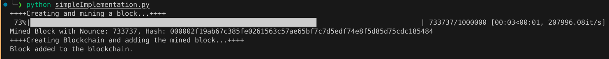

# BlockChain Conceptual Implementation

This project is a very simple implemenation of a blockchain series for money transfer between people.
This goes over the simple concepts of signature validation, PoW (Proof of Work) and hash puzzle and Blockchain creation and maintainability
## Execution example

